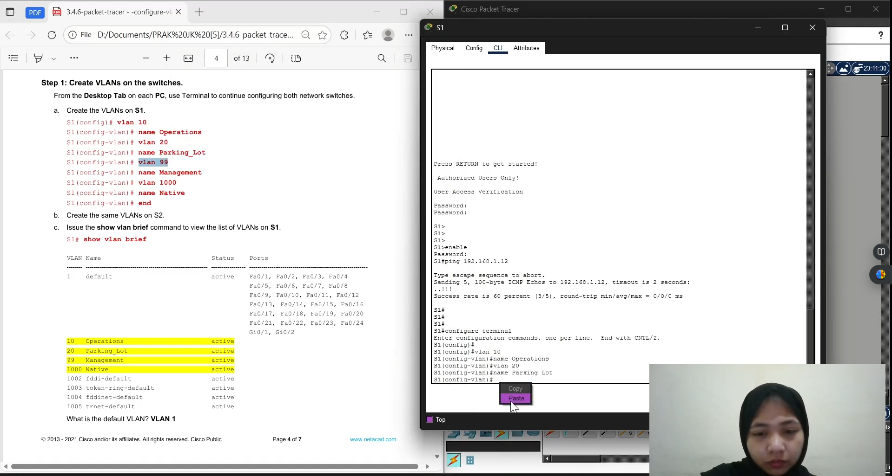
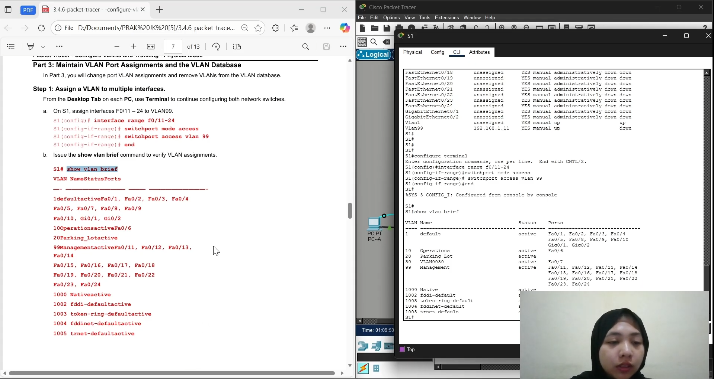
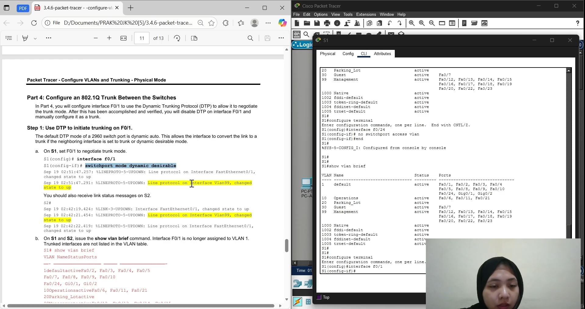

TUGAS AKHIR Praktikum 3 - Jaringan Komputer E

Nama : Erlin Sari Ramadhani

NPM: 2315061056

Link Youtube : [https://youtu.be/eFliFILn2xw?si=3hFp7rMt88cQZDBu](https://youtu.be/eFliFILn2xw?si=3hFp7rMt88cQZDBu)

Part 1 Build the Network & Basic Configuration

Pada tahap ini jaringan dibangun dengan dua switch (S1, S2) dan tiga PC (PC-A, PC-B, PC-C). Setelah pemasangan kabel dan console, dilakukan konfigurasi dasar seperti hostname, password, banner, dan IP VLAN 1. Port yang tidak digunakan dimatikan, kemudian IP PC dikonfigurasi sesuai tabel alamat.

Part 2 Create VLANs & Assign Ports

Tahap ini membuat beberapa VLAN yaitu 10 (Operations), 20 (Parking_Lot), 99 (Management), dan 1000 (Native), serta tambahan 30 (Guest) untuk PC-C. Port-port disesuaikan dengan perangkat, dan IP manajemen dipindahkan ke VLAN 99. Hasil diverifikasi dengan perintah show vlan brief.

Part 3 Maintain VLANs and VLAN Database

Pada bagian ini dilakukan percobaan mengubah dan menghapus VLAN. Port diatur ulang menggunakan interface range, dan ketika VLAN dihapus tanpa reassign port, port menjadi tidak aktif. Setelah dikembalikan ke VLAN 1, port kembali berfungsi normal.

Part 4 Configure 802.1Q Trunk

Port F0/1 pada kedua switch dikonfigurasi menjadi trunk menggunakan Dynamic Trunking Protocol (DTP), lalu diubah ke mode manual dengan switchport mode trunk. Native VLAN juga diubah menjadi 1000 untuk keamanan.

Reflection Question 1

Jawaban:

Agar perangkat pada VLAN 10 dapat berkomunikasi dengan perangkat pada VLAN 99, diperlukan perangkat Layer 3 yang dapat melakukan Inter-VLAN Routing.
Hal ini bisa dilakukan dengan dua cara:

1. Menggunakan Router (Router-on-a-Stick), satu antarmuka fisik router dibuat menjadi beberapa subinterface, dan masing-masing subinterface dikonfigurasikan untuk satu VLAN dengan alamat IP yang berbeda sebagai default gateway tiap VLAN.

2. Menggunakan Switch Layer 3 (Multilayer Switch), switch ini mendukung fungsi routing melalui Switched Virtual Interface (SVI) untuk setiap VLAN.

Tanpa perangkat Layer 3, setiap VLAN tetap terisolasi dan tidak dapat saling berkomunikasi, meskipun berada pada switch yang sama atau terhubung melalui trunk.

Reflection Question 2

Jawaban:

Penerapan VLAN yang efektif memberikan berbagai manfaat penting bagi organisasi, antara lain:

1. Keamanan yang lebih baik, VLAN memisahkan lalu lintas antar departemen atau kelompok pengguna, sehingga data sensitif tidak mudah diakses oleh pihak yang tidak berwenang.

2. Efisiensi biaya, satu perangkat fisik dapat digunakan untuk beberapa jaringan logis, sehingga mengurangi kebutuhan perangkat keras tambahan.

3. Kinerja jaringan lebih baik, dengan membatasi domain broadcast, lalu lintas jaringan menjadi lebih ringan dan efisien.

4. Mengurangi broadcast storm, broadcast hanya terjadi di dalam VLAN masing-masing, sehingga meningkatkan kestabilan jaringan.

5. Manajemen jaringan lebih mudah, VLAN memungkinkan pengelompokan perangkat secara logis berdasarkan fungsi, lokasi, atau tim, sehingga konfigurasi dan troubleshooting lebih sederhana.

6. Fleksibilitas dan skalabilitas, VLAN memudahkan penambahan, penghapusan, atau pemindahan pengguna tanpa perlu perubahan fisik jaringan.

